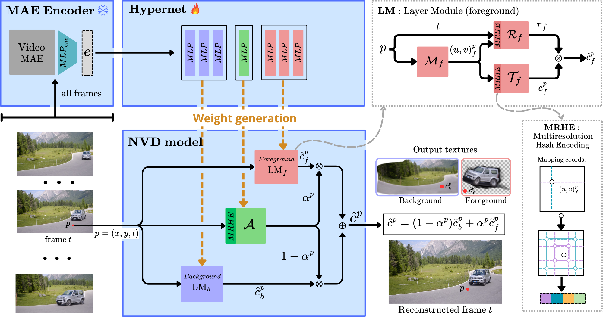

# HyperNVD: Accelerating Neural Video Decomposition via Hypernetworks

### [Project Page](https://hypernvd.github.io/) | [Paper](https://arxiv.org/abs/2503.17276)


## Overview



## Installation

Our code is compatible and validate with Python 3.9.16, PyTorch 1.13.1, and CUDA 11.7.

```
conda create -n hypernvd python=3.9
conda activate hypernvd
conda install pytorch==1.13.1 torchvision==0.14.1 torchaudio==0.13.1 pytorch-cuda=11.7 -c pytorch -c nvidia
pip install matplotlib tensorboard scipy scikit-image tqdm
pip install opencv-python imageio-ffmpeg gdown
pip install easydict
```

We use MaskRCNN for coarse mask extraction.
```
python -m pip install detectron2 -f https://dl.fbaipublicfiles.com/detectron2/wheels/cu113/torch1.10/index.html
```

We use tinycudann for positional encoding, refer to [tinycudann](https://github.com/NVlabs/tiny-cuda-nn) for detailed instructions.
```
$ git clone --recursive https://github.com/nvlabs/tiny-cuda-nn
$ cd tiny-cuda-nn
tiny-cuda-nn$ cmake . -B build -DCMAKE_BUILD_TYPE=RelWithDebInfo
tiny-cuda-nn$ cmake --build build --config RelWithDebInfo -j
```

For VideoMAE embedding:
```
pip install transformers==4.33
pip install pytorchvideo
```

If desired you can also download wandb for logging:
```
pip install wandb
```

## Data preparations

To train our model we use the DAVIS-2016 dataset that you can download from here: [DAVIS](https://davischallenge.org/davis2016/code.html)

### Video frames

The video frames follows the format of [DAVIS](https://davischallenge.org/) dataset. The file type of images should be all either in png or jpg and named as `00000.jpg`, `00001.jpg`, ...

### Preprocess optical flow

We extract the optical flow using [RAFT](https://arxiv.org/abs/2003.12039). The submodule can be linked by the following command:

```
git submodule update --init
cd thirdparty/RAFT/
./download_models.sh
cd ../..
```

To create optical flow for the whole DAVIS dataset, run:

```
python prepare_dataset/preprocess_optical_flow.py --path2DAVIS <path_to_DAVIS> --max_long_edge 768
```

The script will automatically generate the corresponding backward and forward optical flow and store the npy files in the right directory.


### Preprocess MAE embeddings

We extract the embeddings of the DAVIS dataset with the following command:

```
python prepare_dataset/create_videos_DAVIS.py --path2DAVIS <path_to_DAVIS>
python prepare_dataset/EmbedAllVideoMAE.py --path2DAVIS <path_to_DAVIS>
```
This scripts will automatically generate the .mp4 and embeddings of the davis dataset and store them in path2DAVIS/MP4 and path2DAVIS/EMBEDDIGNS respectively. Please download the checkpoint of VideoMAE encoder from [here](https://cvcuab-my.sharepoint.com/:f:/g/personal/dxue_cvc_uab_cat/EmwmLJKcnNRNtCOMqn1qEVcBLaq78D6OeEh_QinjTxZoKQ?e=koZy6X).

## Train hypernet with multiple videos

To train our model like we propose in our paper, you can use the following command: 

```
python train.py config/train_30_videos.py
```

You will need to change the "path2DAVIS" inside the config file. 
You can download our checkpoint for our model trained with 15 videos and 30 videos in the following [links](https://cvcuab-my.sharepoint.com/:f:/g/personal/dxue_cvc_uab_cat/EmwmLJKcnNRNtCOMqn1qEVcBLaq78D6OeEh_QinjTxZoKQ?e=koZy6X).

## Finetune on a new videos

To finetune our model in a new video, run:

```
python finetune.py config/finetune_car-shadow.py
```

You need to replace the `path2DAVIS` to the folder of DAVIS dataset.

The config file and checkpoint file will be stored to the assigned result folder.

## Citation

If you find our work useful in your research, please consider citing:

```
@InProceedings{Pilligua_2025_CVPR,
    author    = {Pilligua, Maria and Xue, Danna and Vazquez-Corral, Javier},
    title     = {HyperNVD: Accelerating Neural Video Decomposition via Hypernetworks},
    booktitle = {Proceedings of the Computer Vision and Pattern Recognition Conference (CVPR)},
    month     = {June},
    year      = {2025},
    pages     = {22933-22942}
}
```

## Acknowledgement

We thank [Hashing-nvd](https://github.com/vllab/hashing-nvd/) and [Layered Neural Atlases](https://github.com/ykasten/layered-neural-atlases) for using their code implementation as our code base. We modify the code structures to meet our requirements.

